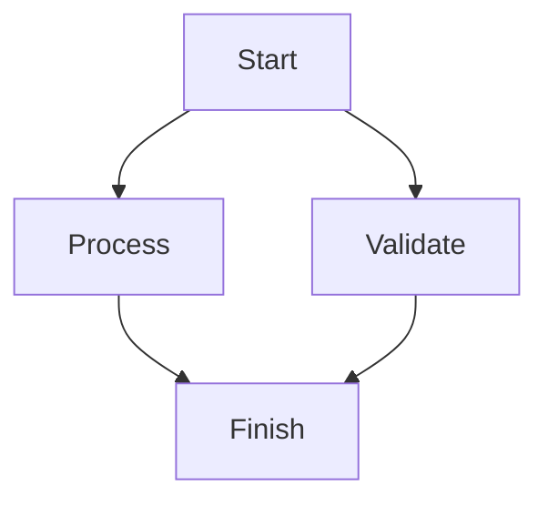

# Introduction

This document verifies that the `swied-markdown-to-pdf` skill handles ordinary
Markdown.

## Formatting

The converter should support:

- **Bold text**
- *Italic text*
- `inline code`
- [Links](https://pandoc.org/)

## Table

| Component | Purpose |
| --- | --- |
| Pandoc | Converts Markdown into Typst input |
| Typst | Typesets the final PDF |

## Code

```python
def greet(name: str) -> str:
    return f"Hello, {name}!"
```

## Mermaid DAG



